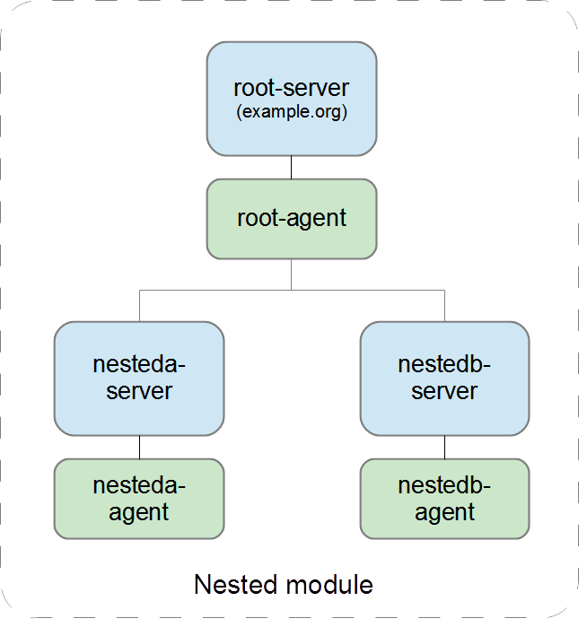
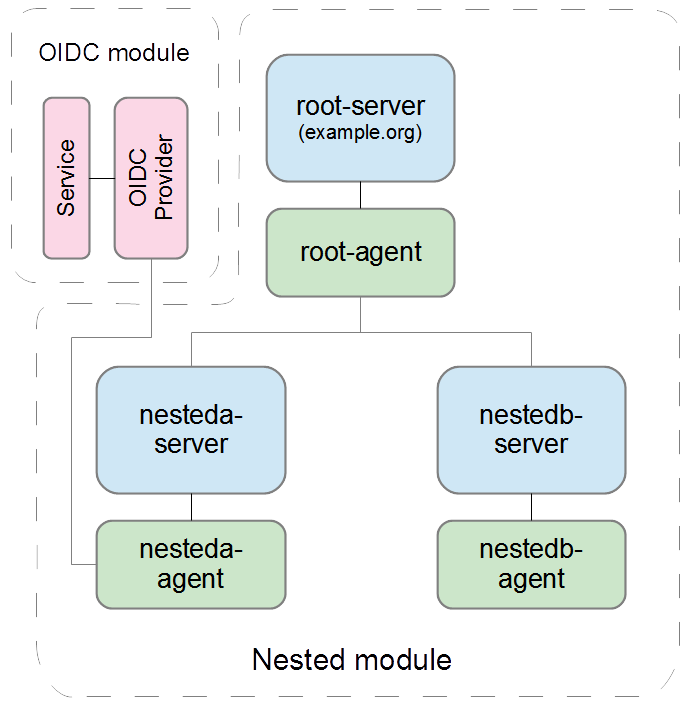
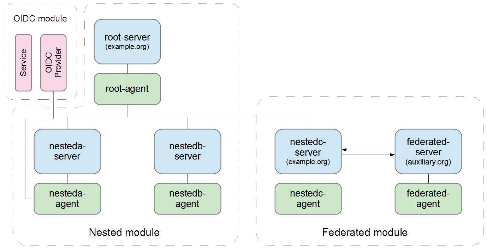

# Overview

`spire-kubernetes-cluster` is a sample deployment of SPIRE in Kubernetes.  It is based on several existing [SPIRE Tutorials](https://github.com/spiffe/spire-tutorials) and [SPIRE Examples](https://github.com/spiffe/spire-examples/tree/main/examples), drawing from both Docker and Kubernetes examples to build this project.  In essence, `spire-kubernetes-cluster` is several of these projects rolled into one.

The project is mainly drawn from the [Nested SPIRE](https://github.com/spiffe/spire-tutorials/tree/main/docker-compose/nested-spire) and [Federated SPIRE](https://github.com/spiffe/spire-tutorials/tree/main/docker-compose/federation) tutorials for Docker, ported to Kubernetes.  Additionally, we include a sample [SPIRE OIDC Discovery Provider](https://github.com/spiffe/spire/blob/main/support/oidc-discovery-provider) and [SPIRE Kubernetes Workload registrar](https://github.com/spiffe/spire/blob/main/support/k8s/k8s-workload-registrar).

## Modular deployment

The project consists of three modules:
1. Nested SPIRE
2. Federated SPIRE
3. OIDC Provider

The **Nested SPIRE**, **Federated SPIRE** and **OIDC Provider** modules can be started and stopped individually.  You can stop and start the **Federated** and **OIDC** modules as needed, but both are dependent on **Nested SPIRE**, so you can't stop **Nested SPIRE** without stopping the other two first.

There is a set of bash scripts to start, stop and test each of the above modules.  There is also a `start_all.sh`, `stop_all.sh` and `test_all.sh`.

NOTE: The project is not representative of how you'd run SPIRE in production, as it runs everything in the same cluster.  It's just for testing and demo.


## Requirements

The project has been tested on Amazon EKS and local kubernetes, but any Kubernetes cluster with sufficient resources should work.


## Amazon EKS Quickstart

For full instructions you can review the [Getting Started with Amazon EKS](https://docs.aws.amazon.com/eks/latest/userguide/getting-started.html) user guide.

Follow the steps from [installing or updating kubectl](https://docs.aws.amazon.com/eks/latest/userguide/install-kubectl.html) and [installing or updating eksctl](https://docs.aws.amazon.com/eks/latest/userguide/eksctl.html) to install these utilities.  When installing a new EKS cluster, you should download the latest `kubectl` and `eksctl` versions available.

### Install a new EKS cluster

Run the following to create an EKS cluster named "spire".  Substitute your desired region.
```
$ eksctl create cluster --name spire --region us-east-2
```
NOTE:
1. There is no dependence on Kubernetes cluster name in the project. so you are free to use any available EKS cluster name here.
2. You must use an EKS "EC2" cluster, you cannot use a Fargate cluster, as Fargate does not support `daemonsets` (see: [AWS Fargate considerations](https://docs.aws.amazon.com/eks/latest/userguide/fargate.html)).

### Deleting the cluster

When you have completed your testing and wish to delete the cluster, run the following command:
```
$ eksctl delete cluster --name spire --region us-east-2
```

### Other helpful commands:

```
$ eksctl info
$ eksctl get cluster
$ eksctl utils write-kubeconfig -c spire
$ cat .kube/config
```


# Launching the project (quickstart)

To start, test and stop all modules:

```
$ start_all.sh
$ test_all.sh
$ stop_all.sh
```

# Launching the project (modular)

## Nested SPIRE module

Run the following to start the Nested SPIRE module:
```
$ scripts/start-cluster.sh
```
This creates the "spire" namespace, and starts three Kubernetes `StatefulSets`: a Root SPIRE server and two Nested SPIRE servers.  The nested servers are "downstream" nodes to the Root.  Also started is one SPIRE Agent for each SPIRE Server, each running as a `DaemonSet`.

Before testing you must run the following to create the Workload registration entries that will allow SVIDs to be fetched from the Agents.  (The above script adds reg entries for the nested servers, not the test workloads.)
```
$ scripts/create-workload-registration-entries.sh
```
To test the cluster:
```
$ scripts/test-cluster.sh
```
This tests that the JWKS keys (signing keys for JWT SVIDs) are uniform across the cluster (a simple way to check that the Nested servers are in sync with the Root), and that an SVID issued by one nested Server can be validated by the other.

To stop the cluster:
```
$ scripts/stop-cluster.sh
```
This stops all the pods and cleans up all resources from the "spire" namespace.

The following diagram shows the artifacts deployed with the Nested module:


<!--img src="images/nested.png" alt="drawing" style="height:500px;"/-->


## OIDC Provider module

The project features a SPIRE OIDC Discovery Provider running in its own pod (Deployment).  The provider is connected to NestedA Agent, but it could alternately be connected to NestedA Server, or really, any Agent or Server in the project.  See comments in "oidc-provider.yaml"

Run the following to start the OIDC Provider Deployment.  The script also creates the workload registration entry for OIDCP, which is required when connected to an Agent.
```
$ scripts/start-oidc-provider.sh
```
To test the OIDC Provider:
```
$ scripts/test-oidc-provider.sh
```
This tests that the list of JWKS keys retrieved from the SPIRE Server matches that retrieved from the OIDC Discovery Provider.

To stop the OIDC Provider:
```
$ scripts/stop-oidc-provider.sh
```
This stops the OIDC Provider Deployment and cleans up the workload registration entry from the Server.

The following diagram shows the artifacts added with the OIDC Provider module:


<!--img src="images/nested-OIDC.png" alt="drawing" style="height:500px;"/-->


## Federated SPIRE module

This creates a SPIRE Server running under a separate SPIFFE trust domain ("auxiliary.org") and adds a Federation relationship to the trust domain for the Nested SPIRE deployment ("example.org").

The Federated module starts a new SPIRE Server and corresponding SPIRE Agent (**federated-server** and **federated-agent**) under "auxiliary.org", and adds a new Server and Agent (**nestedc-server** and **nestedc-agent**) under "example.org".  While it would have been possible to federate to any of the existing servers in "example.org", doing it this way facilitates easy bring-up and tear-down of the Federated module.  Deleting the federated servers on both sides is the simple, clean way to remove the federation, and deleting one of the existing servers would have been too disruptive to the Nested deployment.

Run the following to start the Federated SPIRE module:
```
$ scripts/start-federated.sh
```
This starts the **federated-server** and **federated-agent** as described above, as well as the **nestedc-server** and **nestedc-agent**, and creates a new downstream registration entry for **nestedc-server** (in the same way entries are created for **nesteda-server** and **nestedb-server** in "start-cluster.sh").  It also creates a "federation relationship" between **federated-server** and **nestedc-server**, thereby federating "auxiliary.org" and "example.org" domains.  Finally, the script creates a set of Workload registration entries at the newly-created Servers, to allow SVID fetch from their corresponding Agents, to facilitate the tests.

To test the federated cluster:
```
$ scripts/test-federated.sh
```
This tests that an SVID fetched on one side of the federation relationship can be validated on the other side, thereby verifying the operation of the federation between "auxiliary.org" and "example.org" domains.  It also checks that an SVID fetched from *another* agent in "example.org" (nestedb-agent) can be validated by "auxiliary.org", thereby verifying that the federation relationship is transmitting ALL bundle keys (JWKS) from "example.org" to the server in "auxiliary.org", as is required for proper operation.

To stop the federated cluster:
```
$ scripts/stop-federated.sh --clean
```
You must use the `--clean` option to remove the `PersistentVolumeClaims` associated with  **federated-server** and **nestedc-server** `StatefulSets`.  If you don't do this, the next time the servers come up they will use the old PVCs, which contain the SPIRE Database from the previous run.  This causes problems as the startup script expects to create a fresh DB each time.

If you'd like to shut down the Federated and NestedC agents and servers without deleting the DB (which contains the federation relationship and the registration entries), you can run the script without `--clean`.  You can then restart the Pods by manually applying their YAML files, and the servers will come up on the old DBs.  Note you will have to recreate the downstream registration entry for **nestedc-server**; see the startup script.

If you are planning to shut down the entire cluster (by "stop-cluster.sh"), then it doesn't matter, as all resources will be deleted, including the PVCs.

The following diagram shows the artifacts added with the Federated module:


<!--img src="images/nested-OIDC-federated.png" alt="drawing" style="height:500px;"/-->


# Other features
## Kubernetes Workload Registrar

The project includes a sample SPIRE Kubernetes Workload Registrar deployed as a sidecar to **nestedc-server**.  The Registrar will automatically create a Workload Registration entry for any workload with the appropriate label.

To add a label to a running pod, to enable automatic Spiffe ID creation for that pod:
```
$ kubectl patch deployment spiffe-client -n spire -p '{"spec":{"template":{"metadata":{"labels":{"spiffe.io/spiffe-id": "true"}}}}}'
```
The Registrar will assign a Spiffe ID to any pod with this label, but the Spiffe ID is only fetchable from **nestedc-agent**.  In a production environment you would need to add a Registrar to any server where automatic Spiffe ID creation is desired.

For more information see the  [SPIRE Kubernetes Workload Registrar](https://github.com/spiffe/spire/blob/main/support/k8s/k8s-workload-registrar/README.md) documentation.

## UpstreamAuthority Certificates

The project includes built-in UpstreamAuthority certificates for Nested and Federated deployments.  The certificates are generated on deployment by the "start-cluster.sh" and "start-federated.sh" scripts.  The lifetime of the generated certificates is configurable in these scripts.

## Sample Workload

The project includes a sample workload pod that you can use to test SPIRE authentication.  It includes two utilities written against the SPIRE Workload API, using the Golang SDK:

1. ```spiffe-client``` - A tool that performs the equivalent of a ```spire-agent api fetch``` command: it can fetch an x509 or JWT SVID from an Agent and dump the output to disk files or display the results to stdout.  It can also display a summary of the workload's assigned Spiffe ID, trust domain and corresponding cert chain.  For more information see ```spiffe-client --help``` in the pod.

2. ```https-client``` and ```https-server``` - An HTTP client/server application you can use to test SPIRE-backed TLS and mTLS communication between pods.  It also handles JWT authentication, fetching a JWT SVID from one side of the connection and validating it on the other.  It works by retrieving a ```tlsconfig``` object from the SPIRE Workload API, which can be consumed directly the Golang ```net/http``` package.  The SVID fetch and validation operations are handled entirely through the ```tlsconfig``` object, with rotation and trust bundle updates performed automatically.  For more information see ```https-client --help``` and ```https-server --help``` in the pod.

To deploy the workload you can manually apply the "spiffe-client.yaml".  You can edit the file to configure which SPIRE Agent the workload will access.  You can clone the YAML to create additional instances of the workload, to test authentication across the project: for example to run ```https-client``` on one pod and ```https-server``` on another.

In this example we start the `spiffe-client` pod and run the `spiffe-client` utility to show the acquired Spiffe ID:
```
$ kubectl apply -n spire -f deploy/workload/spiffe-client.yaml

$ kubectl exec -it -n spire deployment/spiffe-client -- spiffe-client -socketPath /run/spire/sockets/agent.sock
- SPIFFE ID = spiffe://example.org/ns/spire/sa/spiffe-client
- TrustDomain = example.org
- Cert[0] Subject = CN=spiffe-client-6b748cb7c9-gtnc7,O=SPIRE,C=US
- Cert[0] Issuer = OU=DOWNSTREAM-2,O=SPIFFE,C=US
- Cert[1] Subject = OU=DOWNSTREAM-2,O=SPIFFE,C=US
- Cert[1] Issuer = O=SPIFFE,C=US
- Cert[2] Subject = O=SPIFFE,C=US
- Cert[2] Issuer = CN=upstream-authority.example.org
```

## Envoy and Emissary samples

The project includes a sample deployment of `spiffe-client` integrated with Envoy and Emissary.

- **Envoy** is an open-source edge and service-level proxy designed for use with cloud-native applications.
- **Emissary** is a modular authorization service that interoperates with SPIRE to fetch and validate JWT SVIDs.

Together the two form an integrated, fully functional HTTP proxy that can handle all SPIRE authentication and authorization operations.  For more information see the [README](./deploy/envoy/README.md).


# Known issues
### 1. K8sr startup timing condition

There is a timing condition in the startup of the "nestedc-server" and "k8s-workload-registrar" containers in **nestedc-server** pod.  This may result in pod being restarted several times, but it should eventually start.  The "start-federated.sh" script will wait for the startup of **nestedc-server** before proceeding.

### 2. Federation link refresh
In SPIRE server federation, the refresh interval of the federated link is based solely on the lifetime of the root x509 cert.  When UpstreamAuthority is used, the refresh interval is calculated against the lifetime of the UpstreamAuthority cert, without regard to the lifetime of the JWT signing keys, which are governed by ```ca_ttl```.  If the lifetime of the UpstreamAuthority cert is significantly longer than the value of ```ca_ttl```, the refresh frequency will be insufficient to keep the JWT signing keys (JWKS) in sync across the federated link, and the JWKS list on both sides of the federation will become stale.

By default, the lifetime of the deployed UpstreamAuthority certificates is 365 days, and the ```ca_ttl``` of all servers is 24 hrs.  This causes the above issue on the **nestedc-server** to **federated-server** federation.  The "test-federated.sh" script will detect this and it will cause the test to fail.

To fix this temporarily, issue the following to force a refresh:
```
$ kubectl exec -it -n spire federated-server-0 -- /opt/spire/bin/spire-server federation refresh -id spiffe://example.org
$ kubectl exec -it -n spire nestedc-server-0 -- /opt/spire/bin/spire-server federation refresh -id spiffe://auxiliary.org
```
Workarounds:
1. Reduce the lifetime of the UpstreamAuthority certs as described above.
2. Increase the value of ```ca_ttl``` in the "server.conf" ConfigMap for all servers in the project (as the JWKS list is comprised of signing keys from all servers).
3. Run without UpstreamAuthority: to do this you must remove the ```UpstreamAuthority{}``` configuration from the "server.conf" ConfigMap in "root-server-base.yaml" and "federated-server-base.yaml", and set ```insecure_bootstrap = false``` in the "agent.conf" ConfigMap for all agents in the project (as the bootstrap cert for all agents is based on the UpstreamAuthority cert).
